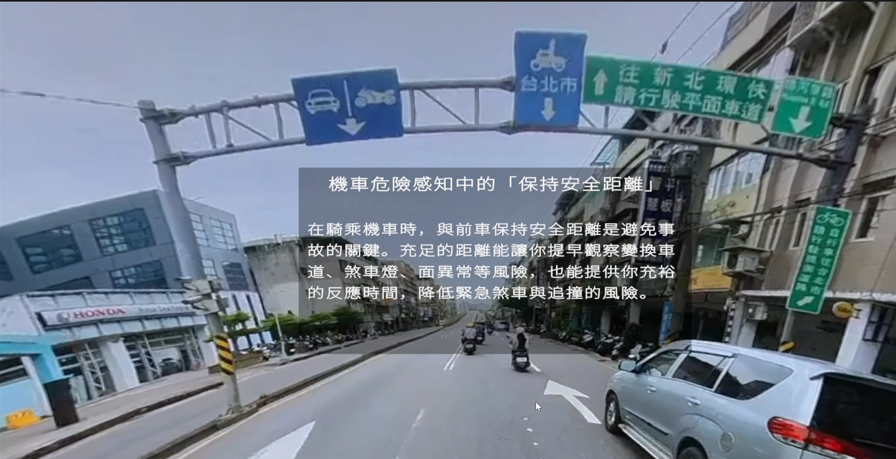

# VR 機車防禦駕駛教學與危險感知測驗

以「保持兩秒車距」為核心的畢業專題，結合 Unity 360° 影片式 VR 教學、桌面危險感知測驗與評分流程，探索虛擬實境在機車防禦駕駛教育中的應用。

本 repository 展示專題背景、Unity 教學腳本及 Python 測驗工具，**包含四支 Unity C# 核心腳本，但不包含完整 Unity 場景、教學與測驗影片或受試者資料**，無法由此重現完整 VR 教學環境。

## 影片展示
[](https://youtu.be/03AhCG8jR48)

## 個人貢獻

Trioc 負責 VR 教學系統開發、危險感知測驗程式開發、數據分析及海報製作。研究為兩人共同參與的畢業專題；另一位組員負責量表設計、受試者招募、質性訪談實驗與訪談內容整理。

## 專題流程

1. 以 Unity 建置第一人稱 VR 教學情境，透過視覺提示說明兩秒車距。
2. 在桌面電腦觀看道路影片，點擊感知到的危險。
3. 匯出點擊座標與影片時間，再批次計算時間評分。
4. 結合安全距離理解量表及訪談資料進行研究分析。

## 已收錄程式

| 檔案 | 功能 |
| --- | --- |
| `unity/Assets/Scripts/` | 四支 C# 腳本：倒數、定時面板、定時物件、確認後繼續播放 |
| `src/hazard_perception.py` | PyQt6 影片播放器：開啟影片、播放與暫停、進度調整、滑鼠點擊及 CSV 匯出 |
| `src/score_clicks.py` | pandas 批次讀取受試者資料夾，依影片危險起始時間計分，輸出總分 |
| `docs/technical-overview.md` | 資料格式、評分方式與實作限制 |

## 執行 Python 工具

需自行準備 Python 環境及可播放的本機影片。

```bash
python -m pip install -r requirements.txt
python src/hazard_perception.py
```

播放器匯出的欄位為 `x,y,time_ms,time_sec`。評分時，在 repository 根目錄自行建立 `click_log/<subject-id>/`，將五支影片的紀錄分別命名為 `click_log_1.csv` 至 `click_log_5.csv`，再執行：

```bash
python src/score_clicks.py
```

輸出位於 `click_log/scores_summary.csv`。目前評分時間僅對應原研究的五支影片；若改用其他影片，需調整 `HAZARD_ONSETS`，不能直接沿用原設定。

## 研究範圍與限制

本研究共招募 21 位參與者，分為 VR 教學組 11 人與簡報教學組 10 人，透過安全距離理解量表、危險感知測驗與訪談比較兩種教學方式。

VR 組的安全距離理解平均分數為 4.45，簡報組為 3.98；等變異數獨立樣本 t 檢定的單尾 p = .044、雙尾 p = .087。危險感知測驗平均分數分別為 86.45 與 94.80，雙尾 p = .238，未達顯著差異。樣本數較少，且評量使用平面影片，結果尚不能推論到實際道路上的駕駛表現。

## 收錄範圍

程式保留原有實驗邏輯；整理時將評分程式的個人電腦絕對路徑改為 repository 相對位置，並改用英文檔名。未附原始海報、報告、影片及受試者紀錄。

## Unity 開發環境

原專案版本為 Unity **2022.3.32f1**。manifest 記錄 TextMesh Pro 3.0.6、XR Interaction Toolkit 2.5.4、OpenXR 1.10.0 及本機 SteamVR OpenVR 套件 1.2.1。

此展示包不附整份 Packages／ProjectSettings：原 manifest 依賴未收錄的 SteamVR 本機套件，將腳本放進 Unity 專案後，仍需自行建立場景、加入依賴並綁定物件。詳見 [Unity 腳本說明](docs/unity-scripts.md)。
